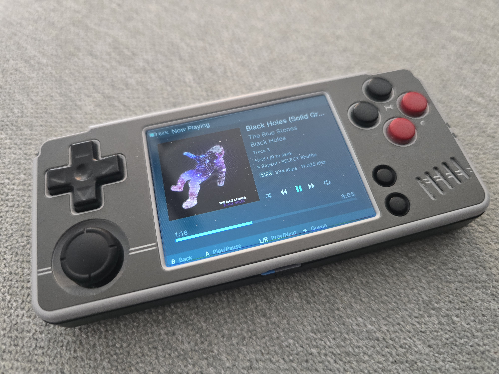

# MiyooPod A30

iPod-inspired music player for the **Miyoo A30** running SpruceOS.



A port of [MiyooPod](https://github.com/danfragoso/miyoopod) by danfragoso, rebuilt for the A30's hardware and SpruceOS environment.

## Features

- iPod-inspired interface with 17 customizable themes
- Browse by Artists, Albums, and Songs
- Search/filter with on-screen A-Z keyboard
- Album art — embedded ID3 tags or auto-fetched from MusicBrainz
- Shuffle and repeat modes
- Seek with accelerating hold speed
- Lyrics display with LRC timed sync and auto-scroll
- Volume and brightness control
- Screen lock via power button
- Session persistence — queue, position, and shuffle/repeat restored on launch
- Over-the-air updates
- Native 640×480 rendering

## Installation

1. Download the latest `MiyooPod-v*.zip` from [Releases](https://github.com/amruthwo/MiyooPod-A30/releases)
2. Extract the zip — you'll get a `MiyooPod/` folder
3. Copy the `MiyooPod/` folder to `/App` on your A30's SD card
4. Eject and reinsert the SD card — MiyooPod will appear in the Apps menu

To reinstall or update manually, repeat the same steps and overwrite the existing folder. Your music library, settings, and artwork are stored separately and won't be affected.

## Adding Music

MiyooPod scans for music in:

```
/mnt/SDCARD/Media/Music/
```

Copy your music files there, organized into artist/album folders if you like. MiyooPod will scan and index them automatically on launch.

## Supported Formats

**MP3**, **FLAC**, and **OGG/Vorbis**

MP3 at 256kbps CBR or VBR V0 is recommended for best performance on the A30's ARM hardware.

## Controls

| Button | Action |
|--------|--------|
| Joystick / D-Pad | Navigate menus |
| A | Select / confirm |
| B | Back |
| L / R | Seek backward / forward (hold to accelerate) |
| Volume Up / Down | Adjust volume |
| SELECT + Volume Up / Down | Adjust brightness |
| Y (Double-Tap) | Lock / unlock screen |
| Power (hold 5s) | Shut down |
| SELECT + START | Quit app |
| R2 / L2 | Move through albums/artists/songs by letter |
| D-Pad UP | In Now Playing to add/remove from Favorites |

## Settings

- **Themes** — 17 themes: Classic iPod, Dark, Dark Blue, Light, Nord, Solarized Dark, Matrix Green, Retro Amber, Purple Haze, Cyberpunk, Coffee, Ocean, Forest, Sunset, Neon, Midnight, Gruvbox, Candy
- **Fetch Album Art** — Download missing artwork from MusicBrainz (requires WiFi)
- **Check for Updates** — Manually check for OTA updates
- **Update Notifications** — Toggle automatic update prompts
- **Rescan Library** — Force a full rescan of your music library
- **Clear App Data** — Reset library cache, settings, and artwork
- **Toggle Logs** — Enable debug logging to `miyoopod.log`
- **About** — View current version

## Troubleshooting

**App won't launch**
Delete the library cache files from your SD card and let MiyooPod rebuild them:
```
/mnt/SDCARD/Media/Music/.miyoopod_library.json
/mnt/SDCARD/Media/Music/.miyoopod_state.json
```

**Album art not showing**
Go to **Settings → Clear App Data**, then use **Fetch Album Art** to re-download.

**Checking logs**
Enable logging from **Settings → Toggle Logs**, reproduce the issue, then check:
```
/mnt/SDCARD/App/MiyooPod/miyoopod.log
```

## Building from Source

Requires Docker and an ARM cross-compiler. The build runs inside a Debian Bullseye container to match the A30's glibc.

```bash
# Build the Docker image (first time only)
docker build -f Dockerfile.build -t miyoopod-builder .

# Cross-compile for ARM
docker run --rm \
  -v $(pwd):/build -w /build \
  -e CC=arm-linux-gnueabihf-gcc \
  -e CGO_ENABLED=1 -e GOARCH=arm -e GOARM=7 -e GOOS=linux \
  -e CGO_CFLAGS="-I/usr/include/arm-linux-gnueabihf" \
  -e CGO_LDFLAGS="-L/build/App/MiyooPod/libs -Wl,-rpath-link,/build/App/MiyooPod/libs" \
  miyoopod-builder \
  go build -buildvcs=false -a -o App/MiyooPod/MiyooPod ./src/*.go
```

## Changelog

### v0.1.5
- Seek precision fix: SDL_Delay after PlayMusic ensures mpg123 is warm before SetMusicPosition (eliminates near-zero seek failures on A30's ARM scheduler)
- Fix seek display racing ahead of audio: wall-clock re-anchor now fires after seek completes, not during
- Fix volume toast always showing 0%: corrected ALSA `amixer` output parsing
- Fix audio cutout on volume press caused by volume incorrectly resetting to 0
- Fix brightness adjustment affecting volume: re-sync ALSA state after brightness change

### v0.1.4
- A30 port: custom SDL2_mixer 2.6.3 bundled for accurate seek and position reporting
- Tracks loaded into RAM before playback to eliminate SD card I/O during seek
- Software wall-clock position fallback (Mix_GetMusicPosition returns 0 on A30's mpg123 backend)
- Seek hold/accelerate: 5s → 10s → 30s jumps on hold
- Shuffle fix: reset current index after building shuffle order
- Session restore: deferred seek no longer blocks app launch
- OTA updater rebuilt for A30 (no libmi_ao.so dependency)

### v0.0.6
- FLAC and OGG/Vorbis playback
- Lyrics: embedded (ID3 USLT, Vorbis) and LRC timed sync with auto-scroll
- Hold up/down to scroll lists continuously

### v0.0.5
- Over-the-air updates with checksum verification and rollback
- Search with on-screen A-Z keyboard
- Seek with accelerating hold speed
- Session persistence
- Header marquee for long track names
- Crash reporting

## Credits

Based on [MiyooPod](https://github.com/danfragoso/miyoopod) by [Danilo Fragoso](https://github.com/danfragoso).

## License

Open Source
